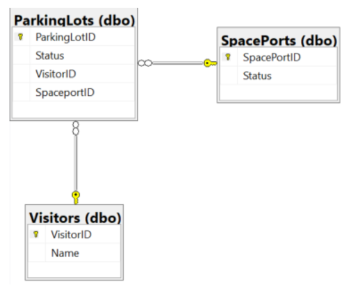

# SpacePark Projektblogg - Grupp 4

### William, Sebastian, Oskar, Anders, Murat

## Applikationen

Fokus på att få basfunktionalitet i appen så att:

- swapi anropas via vår backend
- Checka av så att personen och skeppet finns i Swapi för att kunna parkera
- Backend som sköter den kontrollen via controllers där vi skickar in datan från frontend

Främst fokus på att förstå CI/CD och sätta upp relevant (för oss) deployment och hosting miljö.

### Lösningen (High Level)

### DB:

### Lösningar:

#### Backend: SpacePark.API lösning

#### Controllers:

Swapi controllers som kollar visitor och spaceshipParkinglot, Visitor och spaceport controllers som sköter datan mot DB och att det uppdateras rätt. *(Med hjälpp av sina respektive services)*

#### Services:

Logiken som utför anropen och db uppdateringar. Vi använder oss av Interfaces som vi sen anropar i våra controllers via Dependency Injection.

#### DockerFiles:

Vi har varsin dockerfile i FrontEnd och Backend projekten. 

#### FrontEnd: SpacePark.FrontEnd lösning

#### Models:

Modeller som vi använder för att skapa objekten i FrontEnd från våra anrop så att vi kan visa informationen på hemsidan.

#### Services:

Logiken som sköter anropen till vår backend. Vi har använt oss av MVC mönstret så mycket vi kunnat.

#### Tester: SpacePark.Tests

## Utmaningar

### Planering:

Vi tog för kort tid på oss att tänka igenom vad vi behöver i projektet. Vi var för snabba att skapa tasks i AzureDevops och satte igång att skapa controllers, models...som vi efterhand fick ta bort och tänka om för att få appen att funka som vi ville.

#### Razor pages (*.cshtml.cs & *.cshtml):

Vi fick lära oss syntaxen och hur vi får objekten till att visas på hemsidan. Vad OnGet() och OnPost() metoder gör/används. Hur vi postar data genom att ta användarinput och skicka det i rätt format till vår backend.

#### Azure Container Instance:

Av någon anledning verkade ACI cacha tidigare container images och inte vilja uppdatera till senaste. Efter lite googlande insåg vi att det verkar vara ett problem men vi lyckades inte hitta lösningen på det. 

## Arbetssätt

Azure Devops Boards

Standups vid behov

Vi jobbade framförallt med att använda Azure Devops Boards där vi la upp issues som behövdes göras, till exempel behövde vi göra en Controller gjorde vi ett issue av det. Sedan hade vi kortare standups på de dagar som vi skulle jobba på, kollade om vi hade några mer issues som skulle läggas till och sedan så delade vi upp issues så att folk hade något att jobba med. Förutom dem kortare “standups” vi hade på morgonarna, hade vi lite ett antal diskussioner där vi pratade om hur vi skulle gå vidare med applikationen och ifall vi hade stött på några större problem disskuterade vi lösningar på det. 

När vi väl hade tagit ett issue jobbade vi på olika sätt, ibland när det var ett större issue jobbade vi med pair-programming och ibland på mindre issues satt vi själva och gjorde dem. Vi brukade dock sätta oss tillsammans i discord hela tiden så att vi kunde diskutera lösningar med varandra hela tiden. 

När det kommer till commits och branches i projekt, jobbade vi på det sättet att vi skapade en ny branch som vi döppte till Issue-namnet och sedan när vi kände oss klara gjorde vi en pull-request som minst 2 personer behövde godkänna innan vi mergade in det i master. Vi gjorde vissa undantag på denna regel ifall att flera personer satt med och kollade på koden medans den skrevs eller ifall alla var med på lösningen innan den mergades in. 

När vi körde fast satt vi oftast i grupp och försökte klura ut lösningen genom att:

- steg för steg (debuggern) gå igenom koden
- Ifrågasätta vad koden vi tittar på gör
- fixa fel vi på så sätt upptäckte

## Verktyg

AzureDevops

Docker

Azure Container Registry/InstanceAppService

Azure SQL DB

Git/Github

Postman

## Projektarkitektur

För detta projekt valde vi att använda oss av ett container registry och 2 stycken webb app, en för frontend:en och en för backend:en. Vi valde att använda web apps för containers eftersom det var en billig lösning som också passade väldigt bra till detta projekt. Även om denna service hade kostat mer hade ändå valt att använda den just för hur smidigt det är att lägga upp sin applikation på web app:en och sedan uppdatera den. 

Till en början valde vi att köra våran backend på en container instance istället för en web app. Men efter att vi hade konfigurerat pipelinen till den, märkte vi att den inte uppdaterade sig efter nya images, utan den körde på samma image trots att vi sa åt den att uppdatera sig. Detta var också en anledning till att vi valde en webb app, det passade våra behov bättre. 

Till projektet har vi också kört med CI/CD genom att använda oss av pipelines. Både Frontend:en och backend:en har pipelines och dem har båda nästan identiska YAML-filer. Det första som båda pipelines gör är att dem börjar med att bygga projektet, publisha det och sista bygga en image som läggs upp på vårat container registry, till var sitt repository. I Frontend:en gör vi också en NuGet Restore eftersom vi använder ett NuGet package som vi behöver få med i imagen. Detta sista vi gör är att vi pushar en tom artifact av pipelinen, anledning till att vi pushar upp en tom artifact är för att vi inte behöver jobba med artifact då våra images redan ligger tillgängliga till oss. Det som release pipelines:en gör då är att dem ändrar web app:arna och gör att dem kör på den senaste versionen av image:en som ligger i repository:et. När vi gör det på detta sätt har vi enbart med en artifact för att få igång Release Pipelin:en, men all data den jobbar med ligger på Azure. 

## Kostnader

Web service (2) : 								0.0$(Total cost)
Container Registry(Standard): 		8.49$ (Total cost, running for 8 days non-stop) 

​															  0.854$(Cost per day)					

​															  0.03$(Cost per image uploaded)

**PROVISIONED**

Azure SQLDB:				Gen5 - General Purpose (GP_Gen5_2)

​										 Cost per vCore (in SEK)

​										 1659.07

​										 vCores selected

​										 x 2

​										 Cost per GB (in SEK)

​										 1.11

​										 Max storage selected (in GB)

​										 x 41.6

										 ESTIMATED COST / MONTH 3364.11 SEK

**SERVERLESS**

Azure SQLDB:				Gen5 - General Purpose (GP_S_Gen5_1)

​										Cost per GB (in SEK)

​										1.11

​										Max storage selected (in GB)

​										x 41.6

										ESTIMATED STORAGE COST / MONTH 45.98 SEK
										COMPUTE COST / VCORE / SECOND 10.001292 SEK

Vi har Provisioned nu men hade vi gjort ett verkligt projekt och det hade kostat oss egna pengar så hade vi absolut tagit Serverless konfigurationen medans vi utvecklar..Vi ändra inte detta till Serverless nu utan kör på som vanligt.

### DB Usage:

## Resurser:

Star wars API : https://swapi.dev/

asp.net core CORS: https://docs.microsoft.com/en-us/aspnet/core/security/cors?view=aspnetcore-3.1

Basic artifact information: https://docs.microsoft.com/en-us/azure/devops/pipelines/artifacts/artifacts-overview?view=azure-devops

Publish and download Artifacts:https://docs.microsoft.com/en-us/azure/devops/pipelines/artifacts/pipeline-artifacts?view=azure-devops&tabs=yaml

DOCKER: https://softchris.github.io/pages/dotnet-dockerize.html

Deploy to Azure DevOps :https://www.youtube.com/watch?v=L1Ra1qXv79k

CD pipeline(Release pipeline):https://docs.microsoft.com/en-us/azure/devops/pipelines/release/?view=azure-devop
