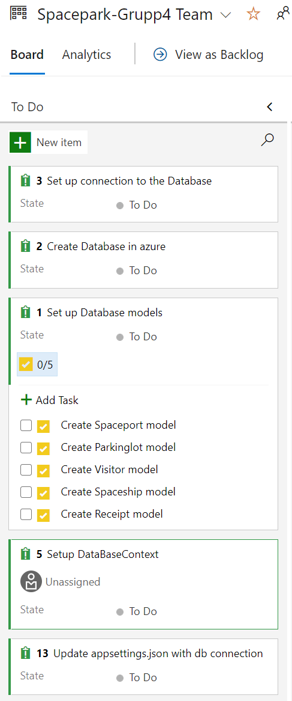

# SpacePark Project Blog - Grupp 4

### Willian, Sebastian, Oskar, Anders, Murat


## Day 1

We cloned the empty github repo provided by Stephan.

We then set out discussing the best (currently) folder structure to have and decided on the following:

### source

This folder keeps all our projects (webapi, webapp, etc.)

### documentation

This folder keeps all the documentation relevant to our project such as (cheatsheet, this document that is our project blog, etc.)

We decided that the README.md is just a description of the project.

It was pretty easy deciding on the folder structure to use and to create a sln file to connect the webapp with the webapi.

We also created a AzureDevOps Pipeline with a standard yaml file with the follwoing content:

(This will change of course)

``````yaml
# Starter pipeline
# Start with a minimal pipeline that you can customize to build and deploy your code.
# Add steps that build, run tests, deploy, and more:
# https://aka.ms/yaml

trigger:
- master

pool:
  vmImage: 'ubuntu-latest'

steps:
- script: echo Hello, world!
  displayName: 'Run a one-line script'

- script: |
    echo Add other tasks to build, test, and deploy your project.
    echo See https://aka.ms/yaml
  displayName: 'Run a multi-line script'
``````


We decided that we would do stand-ups those days we decide to work. Also decided to use the Board feature in AzureDevOps to coordinate tasks.


## Dag 2

Att göra idag

1. Bestämma vilken kod vi ska använda för projektet och bena ut
   * Vi använder ganmla grupp 2 kod som referens


2. Kolla upp vilken databas och azure grejer vi behöver
   * Azure Sql Database Serverless (billigt) standard minimi inställningar
   * Återanväda våra resource groups som vi skapat under kursens gång, likaså containerregistries


3. Skapa tasks i AzureDevOps och assigna de till gruppens medlemmar för att vi kan börja koda backend lokalt


Vi pratade om vår inititala lösning med en sln fil och kom på att det kanske blir svårt att separera backend i en docker contianer och frontend delearna. Vi kommer nog välja att ha separata sln filer för de olika projekten. (Detta kollar vi närmare på när vi vet hur vi får upp en webapp i Azure)


## Initiala tasks och issues på vår AzureDevOps Board



Vi har satt upp en Databas i Azure och kört migrations av vår kod till den med framgång.
Nu har vi basen till backen delen av projektet.


## Dag 3

Sebastian, Anders, Murat, Oskar, William


Vi bestämde oss för följande folderstruktur för att följa någotsånär MVC mönstret:

- Models
  - Håller våra modeller

- Services
  - Logiken för att hantera databasen/SWAPI

- Controller
  - Endpoints som använder sig av services via Dependency Injection

- DataContext
  - Context för vår DB


Vi ska skapa issues på alla de punkter vi kommer på nu för att koda ihop controller, services etc...

## Dag 4

Sebastian, Anders, Murat, Oskar (William kom in senare på dagen)

Vi började dagen med att få till GET och POST metoder för våran "Visitor" controller i API:et och testade så att dessa metoder fungerade. 

Sedan så  bestämde vi oss för att plugga på egen hand om MVC då ingen av oss har jobbat i det tidigare. 

## Dag 5

Idag fick vi till så att vi kan hämta ut en sträng med alla visitors och visa upp det på Frontenden. Allt detta körs lokalt än så länge. 

## Dag 6

Backend: Vi gjort klart så att vi kan göra ett anrop till Swapi, där vi kollar om namnet på besökaren finns med som karaktär i Starwars eller ej. 
Frontend: Håller på och kikar på hur vi skall använda oss av ovan anrop och implementera det. 


